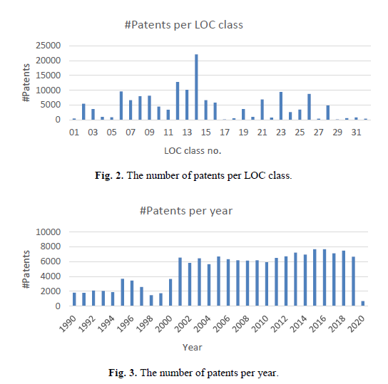
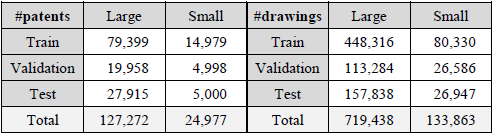
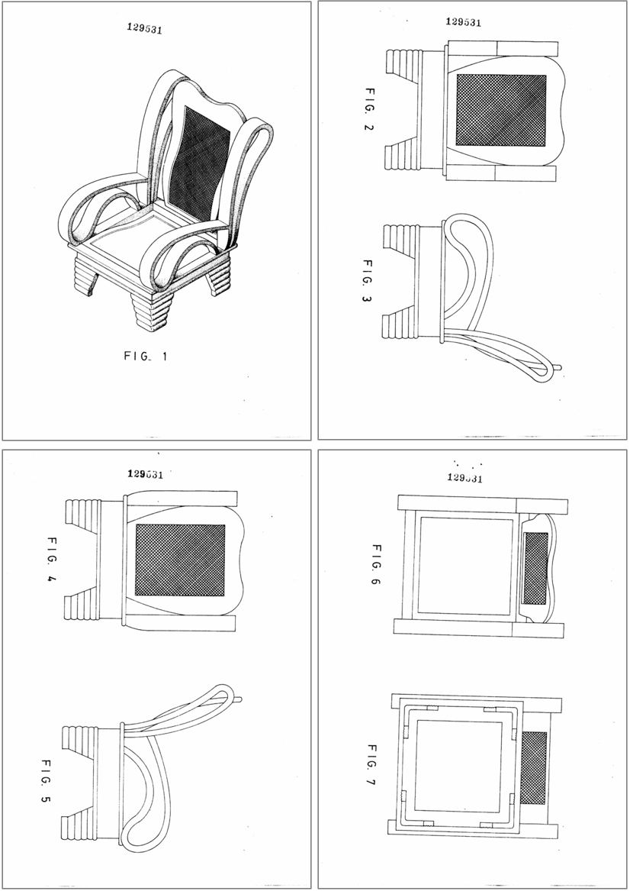
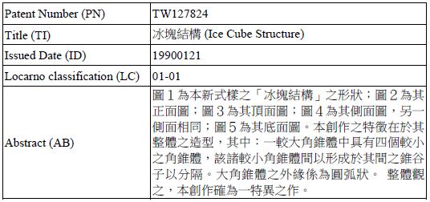

# PDTW150K Dataset
In this repository, we provide the dataset as described in the following paper:

Chan-Ming Hsu, Tse-Hung Lin, Yu-Hsien Chen, and Chih-Yi Chiu.PDTW150K: A Dataset for Patent Drawing Retrieval.

We introduce a new large-scale patent dataset termed PDTW150K for patent drawing retrieval. The dataset contains more than 150,000 patents associated with text metadata and over 850,000 patent drawings. In addition, a set of bounding box positions of individual drawing views is provided to support constructing semantic segmentation and object detection models. We demonstrate the possible ways of using PDTW150K, including image retrieval, cross-modal retrieval, and object detection tasks.

Table 2. The numbers of patents and drawings of the train, validation, and test sets in large and small parts of PDTW105K.

# Example images from the dataset

Fig. 1. An example of two patent drawings with auxiliary information, where the left drawing has one view, and the right drawing has two views.

Table 1. An example of metadata of the patent “Ice Cube Structure.”

# Get the Dataset
The dataset has been compressed and split into 2 parts [Large](). To decompress the dataset, please download all of the parts into a single folder and combine them into a single
[Small](https://drive.google.com/drive/folders/1FmGmE5yeiJB-SpoL1brCyrFUZGDcbQJg)
[Large-part1](https://drive.google.com/drive/folders/1SqoKJxhSMdZ9yhVltzo_RFBPx0tkwWRH?usp=sharing)
[Large-part2](https://drive.google.com/drive/folders/1E0jySfdlLrRf4oUT9ntpwq1wbgnn9v_A?usp=sharing)
[Large-part3](https://drive.google.com/drive/folders/1T02cEnvxAQGZRXLggeaB89PaiaLcP3oA?usp=sharing)

More information and datasets will be available for download later.
