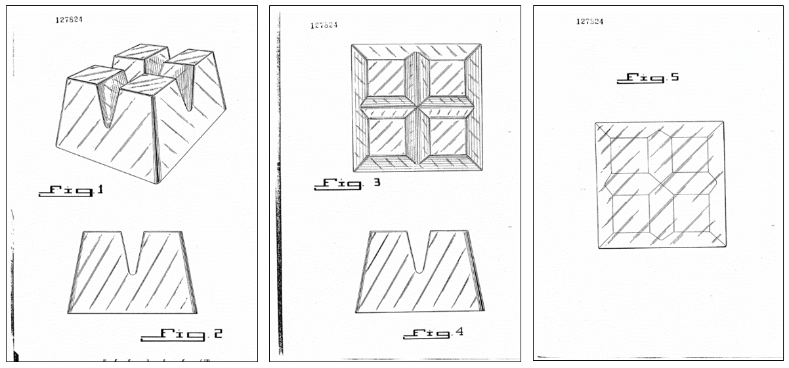

# PDTW150K Dataset
In this repository, we provide the Patent Drawing: Taiwan Dataset 150K (PDTW150K), as described in the following paper:

Chan-Ming Hsu, Tse-Hung Lin, Yu-Hsien Chen, and Chih-Yi Chiu. PDTW150K: A Dataset for Patent Drawing Retrieval.

We introduce a new large-scale patent dataset termed PDTW150K for patent drawing retrieval. The dataset contains more than 150,000 patents associated with text metadata and over 850,000 patent drawings. In addition, a set of bounding box positions of individual drawing views is provided to support constructing semantic segmentation and object detection models. We demonstrate the possible ways of using PDTW150K, including image retrieval, cross-modal retrieval, and object detection tasks.

  
**Table 1.** The numbers of patents and drawings of the train, validation, and test sets in large and small parts of PDTW150K.

| **#patents**   | Large   | Small    | **#drawings**  | Large   | Small   |
|------------|---------|----------|------------|---------|---------|
| Train      | 79,399  | 14,979   | Train      | 448,316 | 80,330  |
| Validation | 19,958  | 4,998    | Validation | 113,284 | 26,586  |
| Test       | 27,915  | 5,000    | Test       | 157,838 | 26,947  |
| Total      | 127,272 | 24,977   | Total      | 719,438 | 133,863 |

  
**Fig. 1.** The number of patents per LOC class.

  
**Fig. 2.** The number of patents per year.

**Table 2.** An example of metadata of the patent “Ice Cube Structure.”

| Patent Number (PN)          | TW127824                                                                                                                                                                                                                                                                                          |
|-----------------------------|---------------------------------------------------------------------------------------------------------------------------------------------------------------------------------------------------------------------------------------------------------------------------------------------------|
| Issued Date (ID)            | 19900121                                                                                                                                                                                                                                                                                          |
| Title (TI)                  | 冰塊結構 (Ice Cube Structure)                                                                                                                                                                                                                                                                     |
| Issued Date (ID)            | 19900121                                                                                                                                                                                                                                                                                          |
| Locarno classification (LC) | 01-01                                                                                                                                                                                                                                                                                             |
| Abstract (AB)               | 圖１為本新式樣之「冰塊結構」之形狀；圖２為其正面圖；圖３為其頂面圖；圖４為其側面圖，另一側面相同；圖５為其底面圖。本創作之特徵在於其整體之造型，其中：一較大角錐體中具有四個較小之角錐體，該諸較小角錐體間以形成於其間之錐谷子以分隔。大角錐體之外緣係為圓弧狀。 整體觀之，本創作確為一特異之作。 |

  

**Fig. 3.** Example images from the dataset.

# Get the Dataset
The dataset has been compressed and split into 2 parts. To decompress the dataset, please download all of the parts into a single folder and combine them into a single

* Small part ([whole](https://drive.google.com/drive/folders/1FmGmE5yeiJB-SpoL1brCyrFUZGDcbQJg)) 

* Large part ([partition_1](https://drive.google.com/drive/folders/1SqoKJxhSMdZ9yhVltzo_RFBPx0tkwWRH?usp=sharing), [partition_2](https://drive.google.com/drive/folders/1E0jySfdlLrRf4oUT9ntpwq1wbgnn9v_A?usp=sharing), [partition_3](https://drive.google.com/drive/folders/1T02cEnvxAQGZRXLggeaB89PaiaLcP3oA?usp=sharing))

# Dataset Availability and Distribution
PDTW150K is provided under “[Open Government Data License, version 1.0 (OGDL-Taiwan-1.0)]( https://www.tipo.gov.tw/en/cp-389-800409-65ea6-2.html)” in a free of charge, non-exclusive, and sublicensable method for the public.

All the patents can be found in “[Taiwan Patent Search System](https://twpat1.tipo.gov.tw/twpatc/twpatengkm)”: use the patent number to search the corresponding patent document. 

